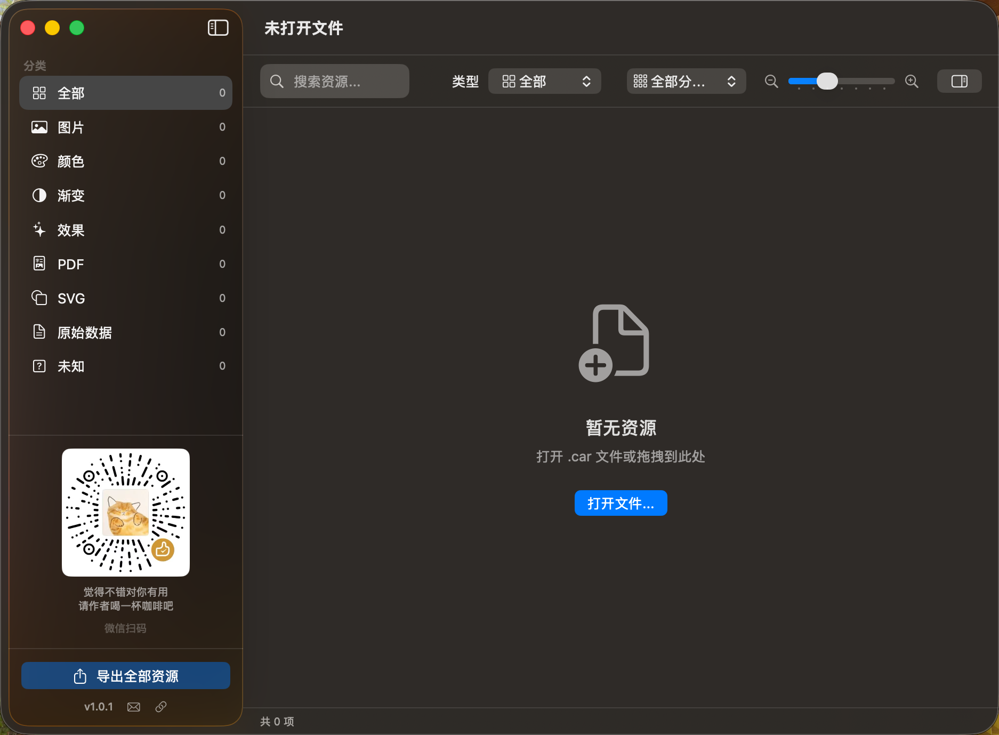
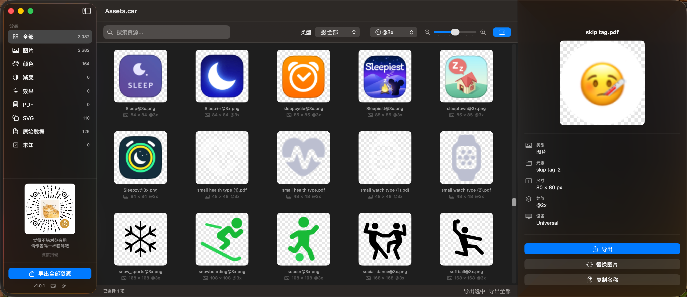
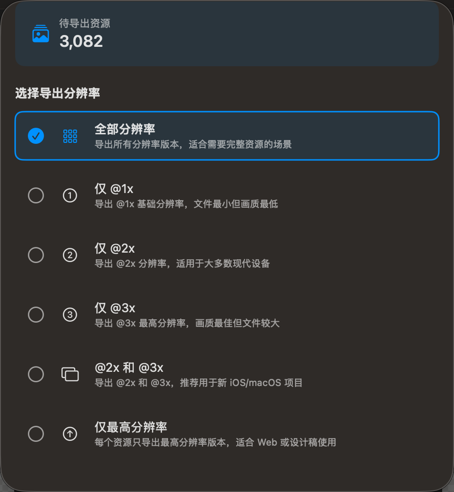
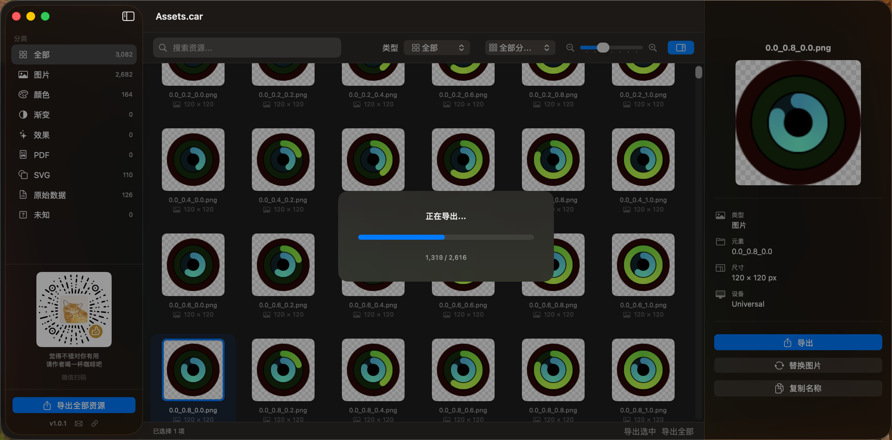
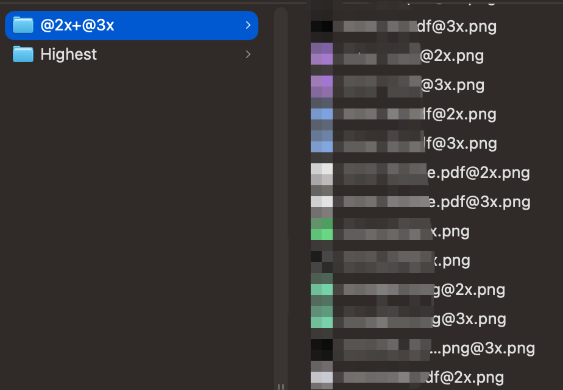

# CarViewer

<p align="center">
  
</p>

<p align="center">
  <strong>A Modern Assets.car Resource Viewer</strong><br>
  现代化的 Assets.car 资源查看器
</p>

<p align="center">
  <a href="README.md">中文</a> | English
</p>

<p align="center">
  <a href="#features">Features</a> •
  <a href="#installation">Installation</a> •
  <a href="#usage">Usage</a> •
  <a href="#architecture">Architecture</a> •
  <a href="#notes">Notes</a> •
  <a href="#acknowledgments">Acknowledgments</a> •
  <a href="#license">License</a>
</p>

---

## Features

### Resource Browsing
- **Multi-type Preview** - Preview images, colors, gradients, PDF, SVG, effects and more
- **Category Filtering** - Quick filter by resource type (images, colors, gradients, effects, etc.)
- **Scale Filtering** - Filter by @1x, @2x, @3x or no scale identifier
- **Search** - Quick search by resource name
- **Grid Zoom** - Adjustable thumbnail size for easy browsing

### Resource Export
- **Batch Export** - Export selected or all resources to PNG format
- **Smart Export Options** - Choose specific resolutions (only @2x, only @3x, highest resolution, etc.)
- **Type Export** - Right-click a category to export all resources of that type
- **Smart Naming** - Exported files automatically include resource name and scale identifier

### Resource Editing
- **Replace Image** - Replace bitmap resources in .car files (select an image and click "Replace Image")
- **Live Preview** - Preview changes immediately after replacement
- **Save Changes** - Changes are saved to the original .car file

### User Experience
- **Modern UI** - Built with SwiftUI, supports dark mode
- **Localization** - Supports English and Chinese
- **Inspector Panel** - Detail panel shows complete resource information (type, size, color values, etc.)

## System Requirements

- macOS 14.0 (Sonoma) or later
- Apple Silicon or Intel Mac

## Installation

### Download Release

Go to [Releases](https://github.com/xiaolajiaoyyds/CarViewer/releases) to download the latest `.dmg` or `.zip` file.

### Build from Source

```bash
# Clone the repository (includes pre-built ThemeKit.framework)
git clone https://github.com/xiaolajiaoyyds/CarViewer.git
cd CarViewer

# Open with Xcode
open CarViewer.xcodeproj

# Or build from command line
xcodebuild -scheme CarViewer -configuration Release build
```

> **Note**: The repository includes a pre-built `ThemeKit.framework`. You can build and run immediately after cloning, no additional configuration needed.

## Usage

### Opening Files

1. Launch CarViewer
2. Use menu `File > Open` or shortcut `⌘O` to select a `.car` file
3. Common `.car` file locations:
   - Inside app bundles: `/Applications/YourApp.app/Contents/Resources/Assets.car`
   - iOS Simulator: `~/Library/Developer/CoreSimulator/...`
   - System resources: `/System/Library/CoreServices/CoreTypes.bundle/Contents/Resources/Assets.car`

### Browsing Resources

- **Sidebar**: Browse resources by category, shows count for each type
- **Grid View**: Preview all resource thumbnails, supports multi-select
- **Detail Panel**: Click a resource to view detailed information (type, size, color values, etc.)

### Filtering Resources

- **Type Filter**: Select resource type in the sidebar
- **Scale Filter**: Use the scale picker in the top toolbar
- **Search**: Enter resource name in the search box

### Exporting Resources

1. **Export Selected**: After selecting resources, use `⇧⌘E` or right-click menu
2. **Export All**: Use `⌥⌘E` or the "Export All Assets" button at the bottom of the sidebar
3. **Export by Type**: Right-click a category in the sidebar, select "Export All XXX"

### Export Options

When exporting, you can choose resolution:
- **All Scales**: Export all versions
- **Only @1x / @2x / @3x**: Export specific resolution
- **@2x and @3x**: Recommended for modern iOS/macOS projects
- **Highest Only**: Export only the highest resolution for each asset

### Replacing Images

1. Select a bitmap resource
2. Click "Replace Image" button in the right detail panel
3. Choose a new image file (supports PNG, JPEG, TIFF)
4. Changes are automatically saved to the .car file

## Screenshots

### Welcome Screen
<p align="center">
  
</p>

### Main Interface
<p align="center">
  
</p>

### Export Options
<p align="center">
  
</p>

### Export Progress
<p align="center">
  
</p>

### Export Result
<p align="center">
  
</p>

## Architecture

```
CarViewer/
├── CarViewer/
│   ├── App/
│   │   └── CarViewerApp.swift          # App entry, menus, about window
│   ├── Models/
│   │   ├── AssetStore.swift            # State management (@Observable)
│   │   ├── RenditionItem.swift         # Resource item wrapper
│   │   ├── RenditionType.swift         # Resource type enum
│   │   └── ScaleFilter.swift           # Scale filter enum
│   ├── Views/
│   │   ├── MainView.swift              # Main layout
│   │   ├── SidebarView.swift           # Sidebar
│   │   ├── AssetGridView.swift         # Resource grid
│   │   ├── AssetCell.swift             # Resource cell
│   │   ├── DetailPanel.swift           # Detail panel
│   │   └── ExportOptionsSheet.swift    # Export options sheet
│   ├── Services/
│   │   └── ExportService.swift         # Export service
│   ├── Resources/
│   │   ├── Assets.xcassets             # App icons, etc.
│   │   ├── Localizable.strings         # Localization strings
│   │   ├── logo.png                    # App logo
│   │   └── zanshangma.png              # Donation QR code
│   └── Supporting Files/
│       ├── Info.plist
│       ├── CarViewer.entitlements
│       └── CarViewer-Bridging-Header.h # Objective-C bridging header
├── Frameworks/
│   └── ThemeKit.framework              # Pre-built ThemeKit framework
└── Docs/
    └── img/                            # Documentation images
```

### Tech Stack

- **SwiftUI** - Modern UI framework
- **@Observable** - Swift 5.9 macro for state management
- **ThemeKit** - Framework for parsing and editing .car files (based on private CoreUI framework)

## Notes

### About CoreUI Private Framework

- `.car` files are Apple's proprietary format, parsing depends on macOS private `CoreUI.framework`
- ThemeKit uses Objective-C Runtime to access private APIs, which may break with macOS updates
- If you encounter compatibility issues, please submit an [Issue](https://github.com/xiaolajiaoyyds/CarViewer/issues)

### About System Resource Editing

- Editing system `.car` files (e.g., `/System/Library/...`) requires disabling SIP (System Integrity Protection)
- **Not recommended** to modify system files as it may cause system instability
- Always backup original files before editing

### About Sandbox Restrictions

- By default, the app can only access files selected by the user
- To access `/System` directory, grant Full Disk Access in System Preferences

### Supported Resource Types

| Type | Description | Editable |
|------|-------------|----------|
| Image (Bitmap) | PNG, JPEG and other bitmap resources | ✅ |
| PDF | Vector PDF resources | ❌ |
| SVG | Vector SVG resources | ❌ |
| Color | Named color resources | ❌ |
| Gradient | Gradient resources | ❌ |
| Effect | Layer effect resources | ❌ |

## Acknowledgments

The core parsing capability of this project is based on [ThemeEngine](https://github.com/alexzielenski/ThemeEngine).

Special thanks to:

- **[Alex Zielenski](https://github.com/alexzielenski)** - Author of ThemeEngine, providing the core implementation for .car file parsing
- **ThemeKit** - Objective-C wrapper for Apple's private CoreUI framework

ThemeEngine is a powerful macOS application that can not only view but also edit .car files. This project (CarViewer) provides a more modern SwiftUI interface and friendlier user experience based on it.

## Support

If you find this project helpful, feel free to buy me a coffee :coffee:

<p align="center">
  
  <br>
  <em>Scan with WeChat</em>
</p>

## Contact

- **Email**: xiaolajiaoyyds@gmail.com
- **GitHub**: [@xiaolajiaoyyds](https://github.com/xiaolajiaoyyds)
- **Issues**: [Submit an Issue](https://github.com/xiaolajiaoyyds/CarViewer/issues)

## License

This project is licensed under the [Non-Commercial License](LICENSE).

- ✅ Allowed: Personal use, educational use, research use, non-profit use
- ❌ Prohibited: Commercial use, selling, using in commercial products
- 📧 For commercial licensing: xiaolajiaoyyds@gmail.com

```
Copyright (c) 2025, xiaolajiaoyyds
All rights reserved.
```

---

<p align="center">
  Made with :heart: by xiaolajiaoyyds
</p>
